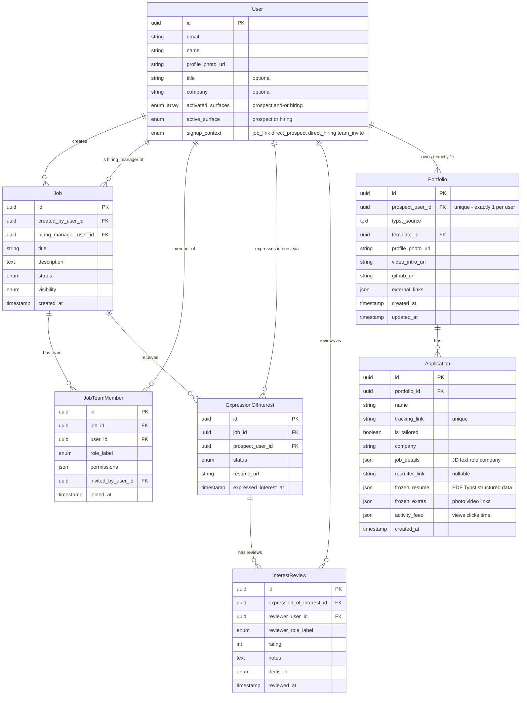

---
confluence:
  page_id: "1654194180"
  space_id: "1644691474"
  parent_id: "1653964805"
  published_date: "2026-01-23"
---

# Helix Entity-Relationship Model

**Product:** Helix (SeekOut.ai)  
**Phase:** Phase 1 MVP  
**Audience:** Engineering Team  
**Last Updated:** January 22, 2026

**Related:** [Entity Model Proposal (Confluence)](https://seekout.atlassian.net/wiki/spaces/PROD/pages/1651048450/Helix+Entity+Model+Proposal)

---

## Overview

This document defines the core entity-relationship model for Helix Phase 1. The model supports:
- Individual hiring managers creating and managing jobs
- Team collaboration with multiple HMs/Recruiters on jobs
- Context-based roles (same user can be HM on Job A, Recruiter on Job B)
- Simple, job-scoped permissions

**Key Decision:** Phase 1 uses **job-level permissions only**. No organization layer. Organizations deferred to Phase 2.

---

## Use Cases

### UC-1: Solo Job Creator
A user creates a job, shares with prospects, reviews prospect interest alone. They are the hiring_manager for this job.

### UC-2: Team Collaboration
A user (hiring_manager on a job) invites other users to help screen prospects and make hiring decisions. Invited users become team members with recruiter or team_member roles on that specific job.

### UC-3: Context-Based Roles
Same user can be hiring_manager on Job A (their team's opening), recruiter on Job B (helping another team), and team_member on Job C (providing consultation).

### UC-4: Role Transfer
A user who is hiring_manager on a job can transfer that role to another team member on that same job.

---

## Core Entities

### User
Represents any person using Helix.

**Properties:**
- Identity information (email, name, photo)
- Optional: title (e.g., "Engineering Manager")
- Optional: company (e.g., "Acme Corp")
- **No inherent role or type** - a user is just a user
- Role (hiring_manager, recruiter, team_member) is determined by their JobTeamMember relationship to specific jobs
- Same user can have different roles on different jobs

**Surface Routing Properties:**
- activated_surfaces (enum array, required): Which product experiences this user has turned on. Values: `prospect`, `hiring`. At least one must always be present. Set on signup based on how the user arrived; grows over time as user activates new surfaces (never shrinks in Phase 1).
- active_surface (enum, required): The surface to render when the user logs in. Values: `prospect`, `hiring`. Must be a value present in `activated_surfaces`. Updated whenever the user switches surfaces in the UI, so it always reflects their last-used view.
- signup_context (enum, required): How and why the user first arrived at the platform. Values: `job_link`, `direct_prospect`, `direct_hiring`, `team_invite`. Immutable after creation. Drives first-time onboarding flow and is useful for analytics and viral loop measurement.

### Job
Represents an open position that needs to be filled.

**Properties:**
- Job details (title, description, requirements, location)
- References one User as the designated hiring_manager (hiring_manager_user_id)
- References the User who created it (created_by_user_id)
- Status (draft, open, closed, archived)
- Visibility (private, public)

**Key Constraint:** Exactly one User designated as hiring_manager per job (enforced via hiring_manager_user_id).

### JobTeamMember
Represents the relationship between a User and a Job they're collaborating on. **This is where role context lives.**

**Properties:**
- References a Job (job_id) and a User (user_id)
- role_label: hiring_manager | recruiter | team_member (the user's role ON THIS SPECIFIC JOB)
- Permissions object (what this user can do on this specific job)
- References who invited them (invited_by_user_id)
- Timestamp of when they joined (joined_at)

**Key Constraint:** One record per (Job, User) pair. Same user can have different role_label values on different jobs.

### ExpressionOfInterest
Represents a user's expression of interest in a specific job (user acting as prospect).

> **UX Note:** Prospect-facing copy should use softer, inviting language rather than formal "application" terminology. Examples: "I'm interested," "Show interest," "Explore this role," "Get in touch," "Learn more & express interest."

**Properties:**
- References a Job (job_id) and a User as prospect (prospect_user_id)
- Status (interested, screening, interview, offer, declined, withdrawn)
- Supporting materials (resume, cover letter, etc.)
- Timestamps

### InterestReview
Represents a user's review of an expression of interest (user acting as reviewer on a job they're a team member of).

**Properties:**
- References an ExpressionOfInterest (expression_of_interest_id) and a User as reviewer (reviewer_user_id)
- reviewer_role_label (the role this user had on the job when they reviewed - hiring_manager, recruiter, or team_member)
- Rating, notes, decision
- Timestamp

---

## Prospect-Side Entities (Portfolio + Applications)

The prospect/job-seeker side follows the **Portfolio + Applications** model. A prospect has exactly **one mutable Portfolio** and creates **many immutable Applications** (snapshots) when sharing. See [Prospect structure](./prospect-structure.md).

### Portfolio
The prospect's single, living profile. Contains resume content in Typst format, extras, and the selected template. Edited directly via natural language.

**Properties:**
- References the owner (prospect_user_id)
- Typst source (typst_source) — resume content in LLM-editable intermediate format
- Template reference (template_id) — chosen during onboarding
- Profile photo, video intro, GitHub URL, external links (portfolio extras)
- Timestamps (created_at, updated_at)

**Key constraint:** Exactly one Portfolio per User. The portfolio is mutable — edits update the Typst source and extras.

### Application
An immutable snapshot created each time the prospect shares their portfolio. Tracks viewer engagement via a unique link.

**Properties:**
- References the Portfolio (portfolio_id) and thus the prospect (via portfolio owner)
- Name (user-provided or auto-generated as "[Company] — [Role]")
- Tracking link (system-generated unique URL)
- is_tailored (boolean — whether JD-based tailoring was applied)
- Date created
- Company name (from JD or user input)
- Job details (JD text, role, company — stored if tailored)
- Recruiter link (if originated from a joblink)
- Frozen resume content (compiled PDF + Typst source + structured data at share time)
- Frozen portfolio extras (photo, video, links at share time)
- Activity feed (views, clicks, time spent — live-updating)

**Key constraints:**
- Application belongs to exactly one Portfolio; Portfolio belongs to exactly one User (prospect).
- Applications are fully immutable after creation — nothing editable except the name.
- Both tailored and as-is shares create tracked Applications with unique links.

---

## Entity Relationships



---

## Key Relationships

### User → Job (Creator)
- **Cardinality:** One User creates many Jobs
- **Constraint:** Job.created_by_user_id references User.id
- **Meaning:** Tracks who originally created the job

### User → Job (Hiring Manager)
- **Cardinality:** One User can be designated as hiring_manager on many Jobs
- **Constraint:** Job.hiring_manager_user_id references User.id
- **Constraint:** Exactly one User designated as hiring_manager per Job
- **Meaning:** The User shown to prospects as the hiring contact; can be different from the User who created the job

### User → JobTeamMember → Job
- **Cardinality:** Many-to-Many through JobTeamMember
- **Constraint:** Unique (job_id, user_id) in JobTeamMember
- **Meaning:** Users can collaborate on multiple jobs with different roles

### Job → ExpressionOfInterest ← User (as Prospect)
- **Cardinality:** One Job has many Expressions of Interest; One User can express interest in many Jobs
- **Constraint:** ExpressionOfInterest.job_id references Job.id; ExpressionOfInterest.prospect_user_id references User.id
- **Meaning:** Users can express interest in jobs (acting as prospects)

### ExpressionOfInterest → InterestReview ← User (as Reviewer)
- **Cardinality:** One ExpressionOfInterest has many Reviews; One User can review many Expressions of Interest
- **Constraint:** InterestReview.expression_of_interest_id references ExpressionOfInterest.id; InterestReview.reviewer_user_id references User.id
- **Meaning:** Users who are JobTeamMembers can review expressions of interest

### User (Prospect) → Portfolio → Application
- **Cardinality:** One User owns exactly one Portfolio; one Portfolio has many Applications
- **Constraint:** Portfolio.prospect_user_id references User.id (unique — one portfolio per user); Application.portfolio_id references Portfolio.id
- **Meaning:** Prospects maintain a single mutable portfolio and create immutable application snapshots when sharing. Applications track what was shared (tailored or as-is) and viewer engagement. See [Prospect structure](./prospect-structure.md).

---

## Role-Based Permissions

### Role Labels (JobTeamMember.role_label)

**hiring_manager:**
- One per job (enforced)
- Shown to prospects as the hiring contact
- Full control over the job

**recruiter:**
- Can be multiple per job
- Equal permissions to hiring_manager (except transfer)
- Shown to prospects when they review expressions of interest

**team_member:**
- Limited permissions
- Can view and review prospects
- Cannot edit job or invite others

### Permission Matrix

| Action | hiring_manager | recruiter | team_member |
|--------|----------------|-----------|-------------|
| Edit job details | ✅ | ✅ | ❌ |
| Review prospects | ✅ | ✅ | ✅ |
| Invite others to job | ✅ | ✅ | ❌ |
| Change job status | ✅ | ✅ | ❌ |
| Transfer HM role | ✅ | ❌ | ❌ |
| View all team reviews | ✅ | ✅ | Limited |

---

## Business Rules

### Rule 1: One Hiring Manager Per Job
- Every Job must have exactly one User designated as hiring_manager
- Job.hiring_manager_user_id must reference a valid User
- Only one JobTeamMember record can have role_label='hiring_manager' per job
- The hiring_manager designation can be transferred to another user on the job team

### Rule 2: Job Creator and Hiring Manager
- A User who creates a Job can either be the hiring_manager themselves (default) or designate another User as the hiring_manager at creation time
- If the creator designates themselves as HM: system creates JobTeamMember record with role_label='hiring_manager' for the creator
- If the creator invites someone else as HM: system creates JobTeamMember record with role_label='recruiter' for the creator, and role_label='hiring_manager' for the invited HM. If the invited HM is not yet on Helix, the system sends an invitation (functions as a team_invite signup_context)
- The hiring_manager designation can be transferred to another user on the job team after creation

### Rule 3: Role Labels Are Job-Specific and Cosmetic
- role_label on JobTeamMember is specific to that job (same user can have different labels on different jobs)
- role_label is primarily for prospect-facing presentation ("Reviewed by [Name] (Recruiter)")
- Actual permissions are stored in the permissions object on JobTeamMember
- hiring_manager and recruiter role labels have nearly identical permissions

### Rule 4: Job-Scoped Visibility
- Users can only see jobs they're a JobTeamMember of
- No global job list or org-wide visibility in Phase 1
- If not on job team → cannot access job

### Rule 5: Invitation Creates Job Team Membership
- For users to collaborate on a job, they must be invited to that specific job
- Invitation creates a JobTeamMember record with the specified role_label for that job
- invited_by_user_id tracks which user invited them
- Only users who have can_invite_others permission on a job can invite others to that job

### Rule 6: Permissions Check Logic
```
To perform action on Job:
1. Get JobTeamMember record for (job_id, user_id)
2. If no record exists → DENY
3. Check permissions object for specific action
4. If permission = true → ALLOW
5. Otherwise → DENY
```

### Rule 7: Review Tracking
- InterestReview stores reviewer_role_label at time of review
- Used for prospect transparency ("Reviewed by [Name] (Recruiter)")
- Preserved even if reviewer's role changes later

### Rule 8: Surface Routing
- Every User must have at least one activated surface (`activated_surfaces` is non-empty)
- `active_surface` must always be a member of `activated_surfaces`
- On login, the app reads `active_surface` to determine which product experience to render
- If `activated_surfaces` has more than one entry, the UI shows a surface switcher in the navigation
- If `activated_surfaces` has only one entry, the UI shows a call-to-action to activate the other surface

### Rule 9: Surface Activation is Additive
- Once a surface is activated, it cannot be deactivated in Phase 1
- Users can switch between activated surfaces freely (updates `active_surface`)
- `activated_surfaces` is initialized on signup based on `signup_context`:
  - `job_link` or `direct_prospect` → `activated_surfaces: ["prospect"]`, `active_surface: "prospect"`
  - `direct_hiring` or `team_invite` → `activated_surfaces: ["hiring"]`, `active_surface: "hiring"`

### Rule 10: One Portfolio Per User
- Each User has exactly one Portfolio (enforced via unique constraint on prospect_user_id)
- The Portfolio is mutable — resume content (Typst source), extras, and template can be updated at any time
- Portfolio is created during onboarding after resume conversion + mandatory first edit

### Rule 12: Application Immutability
- Applications are fully immutable after creation — nothing editable except the name
- Resume content, portfolio extras, and all metadata are frozen at share time
- If the prospect wants to share an updated version, they create a new Application

### Rule 13: Application Creation
- Every share of a portfolio creates a new Application with a unique tracking link
- Both tailored (JD-based) and as-is shares create tracked Applications
- Re-sharing for the same job creates a new Application (no deduplication)
- Tailored applications store the JD, rubric, and tailored Typst source alongside the frozen content

### Rule 11: Signup Context is Immutable
- `signup_context` is set once at account creation and never changes
- Values: `job_link` (clicked a shared job link), `direct_prospect` (signed up to browse jobs), `direct_hiring` (signed up to post a job), `team_invite` (invited to a job team)
- Used for onboarding flow selection and viral loop analytics

---

## Data Flow Examples

### Example 1: Job Creation
```
1. User Alice creates "Software Engineer" job
   → Create Job record (created_by_user_id = Alice, hiring_manager_user_id = Alice)
   → Create JobTeamMember (job_id=Job, user_id=Alice, role_label='hiring_manager')
   
2. Alice can now edit this job, invite others to this job, review prospects for this job
3. Alice's role_label on THIS job is 'hiring_manager'
```

### Example 2: Team Invitation
```
1. Alice (hiring_manager on Job X) invites Bob to help
   → Check: Does Alice have can_invite_others permission on Job X? YES
   → Create JobTeamMember (job_id=X, user_id=Bob, role_label='recruiter', invited_by_user_id=Alice)
   
2. Bob can now access Job X, review prospects, invite others to Job X
3. Bob's role_label on Job X is 'recruiter'
4. Bob might have different role_labels on other jobs (or no role at all)
```

### Example 3: Permission Check
```
1. Bob tries to edit job description on Job X
   → Query: JobTeamMember WHERE job_id=X AND user_id=Bob
   → Found: role_label='recruiter', permissions={can_edit_job: true}
   → Result: ALLOW
   
2. Charlie tries to edit job description on Job X
   → Query: JobTeamMember WHERE job_id=X AND user_id=Charlie
   → Found: role_label='team_member', permissions={can_edit_job: false}
   → Result: DENY
   
3. Charlie tries to edit job description on Job Y
   → Query: JobTeamMember WHERE job_id=Y AND user_id=Charlie
   → Found: role_label='hiring_manager', permissions={can_edit_job: true}
   → Result: ALLOW (Charlie is hiring_manager on Job Y)
```

### Example 4: Role Transfer
```
1. Alice (hiring_manager on Job X) transfers hiring_manager to Bob (recruiter on Job X)
   → Update Job.hiring_manager_user_id = Bob
   → Update JobTeamMember (job_id=X, user_id=Alice): role_label='recruiter'
   → Update JobTeamMember (job_id=X, user_id=Bob): role_label='hiring_manager'
   
2. Bob is now shown to prospects as the hiring manager for Job X
3. Alice remains on the team for Job X with role_label='recruiter'
4. This only affects Job X - Alice and Bob's roles on other jobs are unchanged
```

### Example 5: Prospect Sign-Up and Surface Switch
```
1. Dave clicks a job link shared by Alice
   → Create User (signup_context='job_link', activated_surfaces=['prospect'], active_surface='prospect')
   → Dave sees the prospect experience: browse the job, express interest, track status

2. Dave logs in later
   → Read active_surface='prospect' → Route to prospect view
   → activated_surfaces has 1 entry → Show "Post a job" call-to-action in nav

3. Dave clicks "Post a job"
   → Update activated_surfaces=['prospect', 'hiring'], active_surface='hiring'
   → Dave now sees the hiring experience: create job, share, review prospects
   → Nav now shows surface switcher (can toggle back to prospect view)

4. Dave switches back to prospect view
   → Update active_surface='prospect'
   → Next login will show prospect view by default
```

### Example 6: Portfolio Creation and Application Sharing
```
1. Eve signs up and uploads her resume during onboarding
   → Resume converted to Typst via vision parsing + LLM conversion
   → Eve selects a template and makes a mandatory first edit
   → Create Portfolio (prospect_user_id=Eve, typst_source=..., template_id=...)
   → Eve lands on her portfolio view

2. Eve clicks [Share] and wants to tailor for a Google PM role
   → Eve provides the JD URL
   → System extracts JD → creates rubric scorecard → tailors Typst source
   → Eve previews the tailored version
   → Create Application (portfolio_id=Eve's, name="Google — Sr. PM", is_tailored=true,
     frozen_resume=tailored content, frozen_extras=current extras, tracking_link=unique URL)

3. Eve edits her portfolio via NL ("Add my recent project on LLM evaluation")
   → Portfolio.typst_source updated; portfolio content refreshes
   → The Google application is unchanged (immutable snapshot)

4. Eve shares again for Meta, as-is
   → Create Application (portfolio_id=Eve's, name="Networking — General", is_tailored=false,
     frozen_resume=current portfolio content, tracking_link=different unique URL)
```

---

## Implementation Notes

### Database Constraints
- **Primary Keys:** All entities use UUID
- **Foreign Keys:** Enforce referential integrity
- **Unique Constraints:** (job_id, user_id) in JobTeamMember; prospect_user_id in Portfolio (one per user); tracking_link in Application
- **Check Constraints:** Only one hiring_manager per job (application layer)
- **Indexes:** Add on foreign keys and frequently queried fields

### Permission Storage
- Permissions stored as JSON object in JobTeamMember
- Default permissions based on role_label
- Can be customized per user if needed (future)

### Cascading Deletes
- If Job deleted → Delete all JobTeamMembers, ExpressionsOfInterest, InterestReviews
- If User deleted → Handle based on business rules (TBD)

### Validation Rules
- Email must be unique across Users
- Job.hiring_manager_user_id must reference existing User
- Job.hiring_manager_user_id must match a JobTeamMember with role_label='hiring_manager'

---

## Future Enhancements (Phase 2+)

### Organization Entity
Phase 2 will introduce an Organization layer to support:
- **Company/Team Grouping:** Group jobs under organizations
- **Org-Level Admin Controls:** Admins can see all org jobs
- **Bulk User Management:** Add multiple users to org at once
- **External Collaborator Tracking:** Track agency recruiters across jobs
- **Multi-Organization Support:** Users can belong to multiple orgs (agencies)

**Impact on Phase 1 Model:**
- Job will reference an Organization
- OrganizationMember entity will track user-org relationships
- Two-tier permissions: Org-level (visibility) + Job-level (actions)
- Backward compatible: Phase 1 jobs can be migrated to personal orgs

### Why Not Phase 1?
- Organizations add complexity (2-tier permissions, org management)
- Phase 1 focuses on core collaboration at job level
- Simpler model = faster to build and ship
- Can add based on customer feedback

---

## Questions & Clarifications

**Q: Can a user be on multiple jobs?**  
A: Yes. JobTeamMember is many-to-many. User can have different roles on different jobs.

**Q: What if the user designated as hiring_manager leaves the job?**  
A: The hiring_manager designation must be transferred to another user on the job team first, or the job must be closed.

**Q: Can a user be both hiring_manager and recruiter on the same job?**  
A: No. One role_label per user per job. Choose the appropriate role_label. However, the same user can be hiring_manager on Job A and recruiter on Job B.

**Q: How do prospects see the job?**  
A: Jobs have visibility setting. Public jobs shown to anyone with link. Prospects see the name/photo of the User designated as hiring_manager for that job (via Job.hiring_manager_user_id).

**Q: What happens if a job is deleted?**  
A: All related JobTeamMembers, ExpressionsOfInterest, and InterestReviews are deleted (cascade).

**Q: Can a user who is recruiter on a job become the hiring_manager?**  
A: Yes, via role transfer. The current hiring_manager can transfer the designation to any other user on the job team.

**Q: How does the app know which view to show a user on login?**  
A: The app reads `user.active_surface` to determine which product experience to render (prospect view or hiring view). If `user.activated_surfaces` contains more than one entry, the navigation shows a surface switcher so the user can toggle between views. If only one surface is activated, a call-to-action is shown to activate the other. Switching surfaces updates `active_surface`, so the next login defaults to whichever view the user last used.

---

## References

- [Prospect structure](./prospect-structure.md) - Portfolio + Applications model on job-seeker side
- [Entity Model Proposal (Confluence)](https://seekout.atlassian.net/wiki/spaces/PROD/pages/1651048450/Helix+Entity+Model+Proposal) - Full decision rationale and alternatives
- [Helix Product Overview](./overview.md) - Product vision and strategy
- Related PRDs: Job Posting, Prospect Interest, Prospect Review

---

**Document Status:** Ready for Implementation  
**Next Steps:** DB schema definition, API contract design, UI/UX mockups
