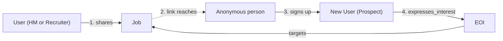
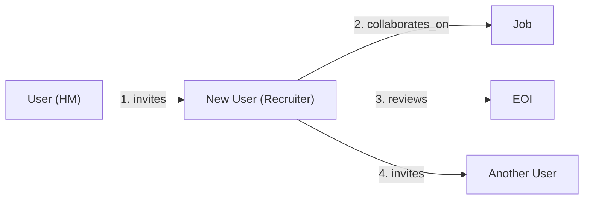
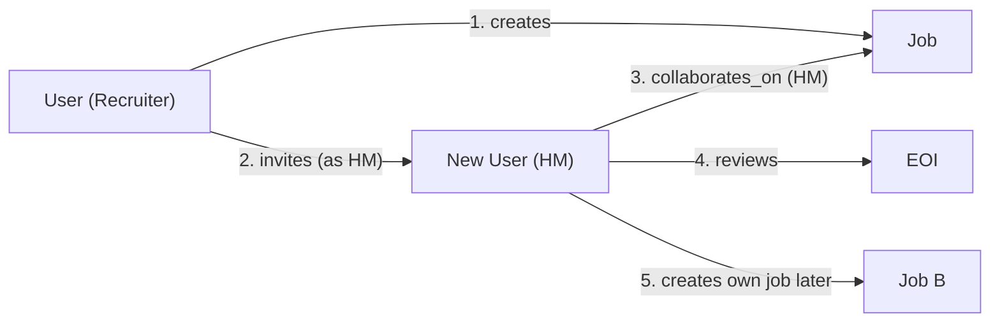
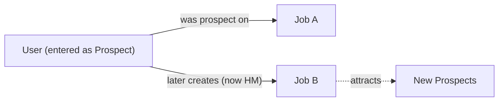
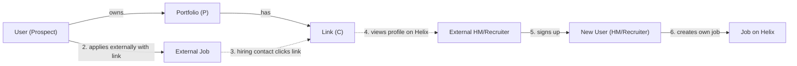
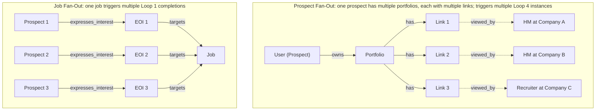

# Helix Network Model

**Product:** Helix (SeekOut.ai)
**Phase:** Phase 1
**Last Updated:** March 4, 2026

**Related:** [Entity-Relationship Model](./entity-relationship-model.md) (database schema) | [Network Quantification](./analytics/network-quantification.md) (Helix Size and health) | [Viral Loop Metrics](./analytics/viral-loop-metrics.md) (per-loop funnels and growth tracking) | [Helix Overview](./overview.md) (product vision)

---

## Purpose

This document defines the Helix network as a graph -- the nodes, edges, personas, and viral loops that make up the structure. It answers one question: **what does the network look like?**

This is not a database design (the [entity-relationship model](./entity-relationship-model.md) handles storage) or a measurement framework (the [network quantification](./analytics/network-quantification.md) doc handles metrics and formulas). This is the conceptual model -- the thing you can point at and say "this is the shape of our product."

---

## 1. The Network Visualized

### The Schema Graph

This diagram shows every node type and edge type in the Phase 1 Helix network:

**Key observations:**
- All these "User" nodes are the *same entity type*. A single User can appear on the hiring side for one Job and on the prospect side for another. The persona is not an attribute of the user -- it is determined by which edge they are participating in.
- **The hiring side has two personas: HM and Team.** The hiring_manager is exactly one per job -- the designated decision-maker shown to prospects. "Team" encompasses recruiters and team members. The distinction between recruiter and team_member is a permissions difference (recruiters can share, invite, and create jobs; team members can only review) -- see the [permission matrix](./entity-relationship-model.md#permission-matrix) in the entity-relationship model. In the network graph, both connect to the same node types via the same edge types.
- **Either a hiring manager or a team member (recruiter) can create a job.** When a recruiter creates a job, they designate someone else as the hiring manager via an `invites` edge. The designated HM may or may not already be on Helix -- if not, this functions as an invitation that creates a new User node.
- **Prospects have a parallel sharing path.** A prospect owns Portfolios (P); each portfolio has multiple Links (C). They create and share links externally (in job applications, on social media); external viewers can view the profile on Helix. This mirrors the hiring-side `shares` edge but originates from the prospect side. When an external viewer is a hiring contact at another company, this edge can pull them into the network (Loop 4). See [Prospect structure](./prospect-structure.md).

---

## 2. Node Types

Five node types in the Phase 1 network, defined by their role in the graph:

### User

The actor in the network. Users have no inherent persona -- their role is determined entirely by which edges they participate in.

- **Network role:** Can be a hub (highly connected to many Jobs) or a leaf (connected to one Job)
- **Entry point:** New User nodes are created when someone signs up. The `signup_context` field records which edge brought them in (`job_link`, `direct_prospect`, `direct_hiring`, `team_invite`)
- **Persona viewport:** The `activated_surfaces` field tracks which sides of the network a User has participated in. The `active_surface` field determines which subgraph the UI shows them

### Job

The connecting node in the network. A Job creates the context where hiring teams and prospects interact -- it gives the hiring side a way to find candidates and gives prospects opportunities to express interest.

- **Network role:** Every connection between users flows through a Job. A Job connects its designated HM, its creator (who may be a different person -- e.g., a recruiter), additional team members, and its prospects (via EOIs)
- **Creator vs. HM:** A Job tracks both `created_by_user_id` and `hiring_manager_user_id`. These can be the same person (HM creates their own job) or different people (recruiter creates a job and designates someone else as HM)
- **Connections:** A Job's edges include its HM, team members (via `collaborates_on`), and prospects (via EOIs)

### ExpressionOfInterest (EOI)

The bridge between the hiring side and the prospect side. An EOI creates a connection between a User-as-prospect and a Job, making the prospect visible to the Job's hiring team.

- **Network role:** Bridge node. Without EOIs, the hiring side and prospect side are disconnected subgraphs. Each EOI creates a path from a prospect to the hiring team
- **Carries metadata:** InterestReview data (rating, notes, decision) lives on the `reviews` edges that connect team members to this EOI

### Portfolio (P)

The prospect-side container for shareable content. A prospect (User) can create **multiple portfolios**. See [Prospect structure](./prospect-structure.md) (P = Portfolio, C = Link) and the [Figma flow chart](https://www.figma.com/board/6rZK7e7bmm2R6L2fpiTu7X/Flow-chart--Community-?node-id=5141-416).

- **Network role:** Groups links (CustomLinks) under a single owner. User → owns → Portfolio → has → Link(s)
- **Structure:** One User can own many Portfolios; one Portfolio has many Links (CustomLinks)

### CustomLink (C — Link)

The prospect-side viral unit. A **Link** (custom link) is a shareable URL **belonging to a Portfolio**. Each portfolio can have multiple links. Prospects create links and distribute them externally — in job applications, on social media, or directly to contacts.

- **Network role:** Viral artifact. Links are how the prospect side generates external impressions, mirroring the hiring side's job sharing. Each Link viewed by an external person is a potential entry point into the network (Loop 4)
- **Variants:** General (whole portfolio) or job-specific (target role/company)
- **External reach:** Unlike EOIs (which connect prospects to jobs within the network), Links reach outside the network boundary. The `viewed_by` edge from a Link is passive — it creates no nodes or edges directly, but triggers inbound paths when external viewers sign up

### What About JobTeamMember and InterestReview?

These are **edge metadata**, not standalone nodes:

- **JobTeamMember** is the metadata on a `collaborates_on` edge (User -> Job). It carries the role_label, permissions, and invitation context
- **InterestReview** is the metadata on a `reviews` edge (User -> EOI). It carries the rating, notes, decision, and the reviewer's role at the time of review

In graph terms: these are *properties on edges*, not nodes with their own connections.

---

## 3. Edge Types with Persona Context

Every edge in the Helix network carries a **persona context** -- the role the User is playing when this edge exists. This is the key structural insight: persona lives on the edge, not the node.

### Edge Catalog

| Edge | Direction | Persona | Creates When | Network Effect |
|------|-----------|---------|-------------|----------------|
| `creates` | User -> Job | hiring_manager / team | User posts a new job | +1 Job, +1 edge |
| `invites` | User -> User (via Job) | hiring_manager / team | User invites someone to a job team | +1 edge, potentially +1 User node |
| `collaborates_on` | User -> Job | hiring_manager / team | User is on a job's team -- whether they created the job, were invited as HM, or were invited as team | +1 edge (or +1 User node if new to platform) |
| `expresses_interest` | User -> Job (via EOI) | prospect | User engages with a job | +1 EOI bridge, +1 edge (or +1 User + 1 EOI if new) |
| `reviews` | User -> EOI | hiring_manager / team | Team member reviews a prospect's EOI | +1 edge |
| `shares` | User -> external | hiring_manager / team / prospect | User distributes a job link (hiring side) or a portfolio link (prospect side) externally | +0 nodes/edges, but triggers potential inbound paths |
| `owns` | User -> Portfolio | prospect | User creates/owns a portfolio (P) | +1 Portfolio node |
| `has` | Portfolio -> Link (CustomLink) | -- | Portfolio contains a shareable link (C) | +1 Link node |
| `creates_link` | User -> Link (via Portfolio) | prospect | User adds a link to a portfolio (general or job-specific) | +1 Link node, edge to Portfolio |
| `targets` | EOI -> Job | -- (structural) | EOI is created targeting a specific Job | +1 edge (created automatically with the EOI) |
| `viewed_by` | Link (CustomLink) / Job -> external | -- (passive) | External person views a prospect's profile via a link or a shared job link | +0 nodes/edges, but triggers potential inbound paths (Loop 1, Loop 4) |
| `signs_up_as` | External -> User | -- (conversion) | External viewer creates an account after viewing a job link or custom link | +1 User node, +1 edge |

### How Personas Emerge

A User does not *have* a persona. They *act in* a persona through their edges:

- **hiring_manager:** The set of edges where a User is the designated HM on a Job -- they review EOIs, invite team members, and make final decisions. Exactly one per job. The HM may have created the Job themselves, or may have been designated by someone else (a recruiter) via an invite
- **team (recruiter / team_member):** The set of edges where a User collaborates on a Job they didn't create as HM. Some team members have full operational permissions (recruiter: can create jobs, share, invite others) while others have limited permissions (team_member: can only review). In the network graph, both connect to the same nodes -- the permission difference is edge metadata, not topology. See the [permission matrix](./entity-relationship-model.md#permission-matrix) for details
- **prospect:** The set of edges where a User expressed interest in a Job via an EOI

The `activated_surfaces` field on the User entity is the UI-level reflection of this: it tracks whether a User has *any* hiring-side edges (`hiring` surface) and/or *any* prospect-side edges (`prospect` surface). The UI shows a surface switcher when both are active.

The `signup_context` field records the **entry edge** -- which edge type first brought this User into the network.

---

## 4. Viral Loops as Graph Paths

Each viral loop is a **closed path** through the network graph -- a sequence of edges that, when completed, adds new nodes and edges. The network grows each time a loop completes.

### Loop 1: Job Sharing (HM/Recruiter -> Prospect)

The primary growth loop. A hiring manager or recruiter shares a job externally, bringing new users into the network as prospects.

**Growth per completion:** +1 User node, +1 EOI node, +2 edges (signs_up, expresses_interest)

**K = i * c mapping:**
- **i** (invitations) = number of people who see the shared job link per share event
- **c** (conversion) = fraction who click, sign up, and express interest

### Loop 2: Team Invite (HM/Recruiter -> more team)

A hiring manager or recruiter invites someone to collaborate on a job, bringing new users into the hiring side of the network. This loop has two variants:

**Variant A: Invite to existing job**

**Variant B: Recruiter creates job and invites HM**

This is particularly powerful because the invited HM may not be on Helix yet. The recruiter pulls them in.

Variant B is a high-leverage loop because the invited HM arrives with a job already set up for them. They don't have to go through job creation -- they land directly in the review flow. And once activated, they may create their own jobs (step 5), compounding the effect.

**Growth per completion:** +1 User node (if invitee/designee is new), +1 Job (variant B), +2-3 edges

**K = i * c mapping:**
- **i** = team invites + HM designations per user per job
- **c** = invite/designation acceptance rate

### Loop 3: Cross-Persona Bridge (Prospect -> HM)

The most valuable loop for long-term network health. A prospect who joined to apply for a job later posts their own job, crossing from the prospect side to the hiring side.

**Growth per completion:** +1 Job, new edges from the new Job's sharing and team loops

**Why this matters:**
- Creates a new Job on the platform, opening another context for user acquisition
- Bridges the prospect-side and hiring-side subgraphs through a single user
- Transforms a linear acquisition (user comes, uses, leaves) into a compounding acquisition (user comes, uses, *creates new Job*, attracts more users)

### Loop 4: Link Virality (Prospect -> External HM/Recruiter)

A prospect has one or more portfolios (P); each portfolio has one or more links (C). They add a link to a portfolio and use it when applying to external jobs. The hiring contact at the external company clicks the link, views the prospect's profile on Helix, discovers the platform, and signs up. See [Prospect structure](./prospect-structure.md).

**Growth per completion:** +1 User node (external HM/Recruiter), potentially +1 Job (if they create a job)

**K = i * c mapping:**
- **i** = links (per portfolio) used in external applications per prospect
- **c** = fraction of hiring contacts who click the link, view the profile, and sign up

### Fan-out: Why Loops Compound

The loops above show single-path completions. In practice, individual nodes trigger multiple loop instances simultaneously -- this is fan-out.

In K = i × c, the **i** (invitations/actions per user) IS the fan-out. A prospect with multiple portfolios and multiple links per portfolio triggers multiple Loop 4 instances. A job attracting many prospects creates more review edges and more team expansion opportunities.

### Loop Summary

| Loop | Path | New Nodes |
|------|------|-----------|
| Job Sharing | HM/Recruiter -> share -> signup -> EOI | +1 User, +1 EOI |
| Team Invite | HM/Recruiter -> invite -> accept -> collaborate (Variant B: recruiter creates job and designates HM) | +1 User, +1 Job (variant B) |
| Cross-Persona Bridge | Prospect -> creates own Job | +1 Job |
| Link Virality (P/C) | Prospect -> portfolio link in external application -> HM views profile -> signs up | +1 User |

---

*This document complements the [Prospect structure (P/C)](./prospect-structure.md) (portfolios and links), [Entity-Relationship Model](./entity-relationship-model.md) (database schema), [Network Quantification](./analytics/network-quantification.md) (Helix Size and health), [Viral Loop Metrics](./analytics/viral-loop-metrics.md) (per-loop funnels and growth tracking), and [Helix Overview](./overview.md) (product vision).*
