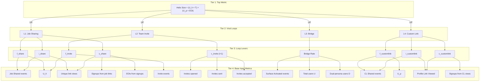
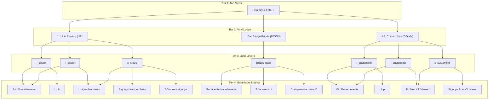
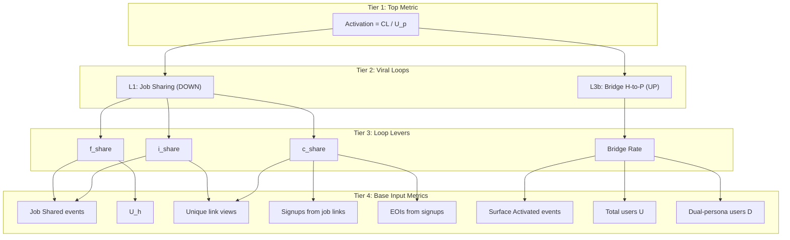
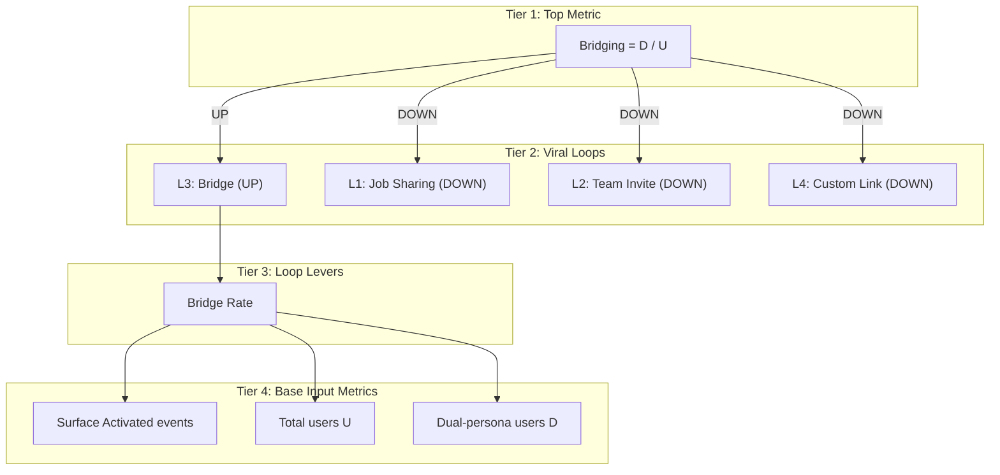
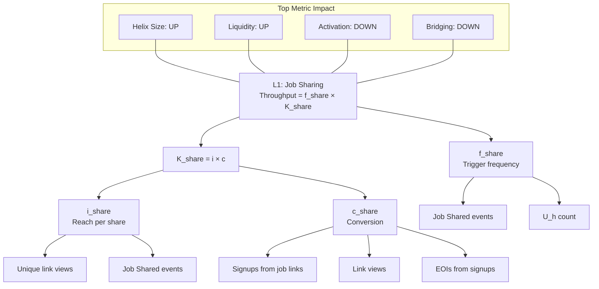
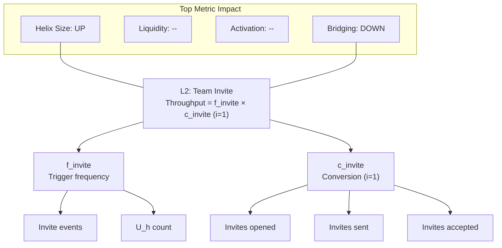
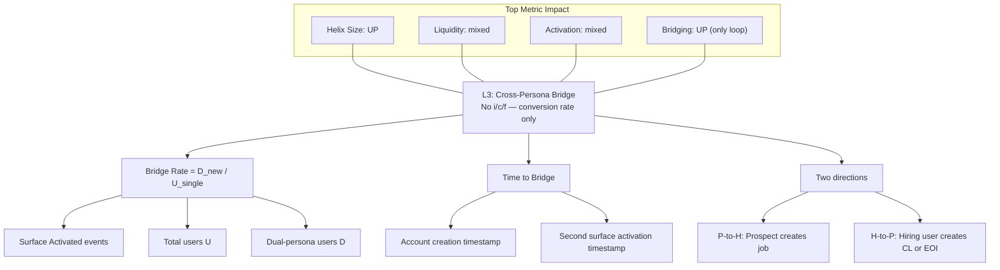
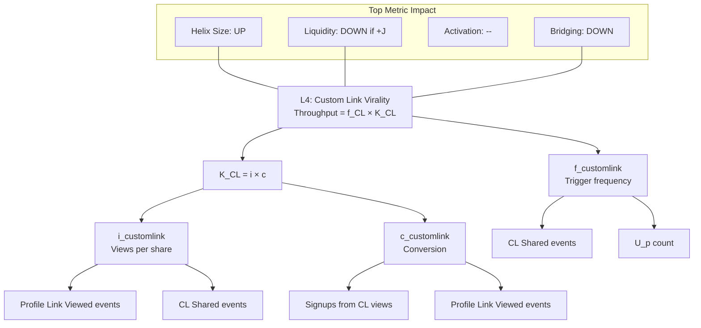

# Tiered Metric System Diagrams

**Product:** Helix (SeekOut.ai)
**Last Updated:** March 4, 2026

**Related:** [Viral Loop Metrics](./viral-loop-metrics.md) | [Network Quantification](./network-quantification.md)

---

## How to Read These Diagrams

Three-tier hierarchy flows from top-level outcomes down to trackable inputs:

1. **Tier 1 — Top-Level Metrics:** Helix Size, Liquidity, Activation, Bridging
2. **Tier 2 — Viral Loops:** Each loop's throughput = f × i × c (except Loop 3: bridge rate)
3. **Tier 3 — Base Input Metrics:** Raw event counts and entity counts from analytics

Loop 3 (Cross-Persona Bridge) has no i/c/f structure — it's measured as a conversion rate (D_new / U_single).

### Loop-to-Metric Impact Reference

| Loop | Helix Size | Liquidity (EOI/J) | Activation (CL/U_p) | Bridging (D/U) |
|------|-----------|-------------------|---------------------|----------------|
| L1: Job Sharing | UP | UP (+EOI) | DOWN (+U_p) | DOWN (+U) |
| L2: Team Invite | UP | — | — | DOWN (+U) |
| L3: Bridge | UP | mixed | mixed | UP (+D) |
| L4: Custom Link | UP | DOWN (+J) | — | DOWN (+U) |

---

## Idea 1: Per-Metric Decomposition

One diagram per top-level metric showing its full decomposition tree.

---

### Version 1B: Layered Bands

Same metric decomposition as 1A, but using subgraphs to create explicit tier boundaries. Visual emphasis on the three-tier structure.

#### 1B: Helix Size

#### 1B: Liquidity

#### 1B: Activation

#### 1B: Bridging

---

## Idea 3: Loop-Centric View

Organized by loop rather than by metric. Answers: "What happens if we improve Loop X?"

---

### Version 3A: One Diagram Per Loop

Each loop gets its own diagram showing which top metrics it impacts, its throughput decomposition, and base input metrics.

#### 3A: Loop 1 — Job Sharing

#### 3A: Loop 2 — Team Invite

#### 3A: Loop 3 — Cross-Persona Bridge

#### 3A: Loop 4 — Custom Link Virality

